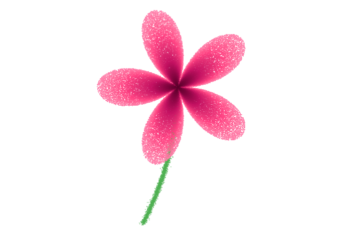

# 🌺 Hibisco Puntillista (Generative Art)

Este proyecto explora la creación de formas orgánicas utilizando **geometría polar** y técnicas de **muestreo aleatorio (rejection sampling)** en R.

## 🧮 La Matemática
La forma de la flor no está dibujada línea por línea, sino definida por una desigualdad matemática.

Se generan **100,000 puntos aleatorios** $(r, \theta)$ y se filtran aquellos que cumplen la condición de la "Curva de Rosa":

$$r < |\sin(2.5 \cdot \theta)| + 0.1$$

* El factor `2.5` crea la simetría de 5 pétalos.
* El `+ 0.1` añade robustez al centro.

## 🖼️ Resultado

El resultado es una visualización estilo puntillismo donde la densidad de puntos crea la ilusión de volumen y textura.

## 🛠️ Stack Tecnológico
* **Lenguaje:** R
* **Librerías:** `ggplot2`, `dplyr`
* **Conceptos:** Coordenadas Polares, Trigonometría, Data Art.

---
[⬅️ Volver al Portafolio Principal](../)